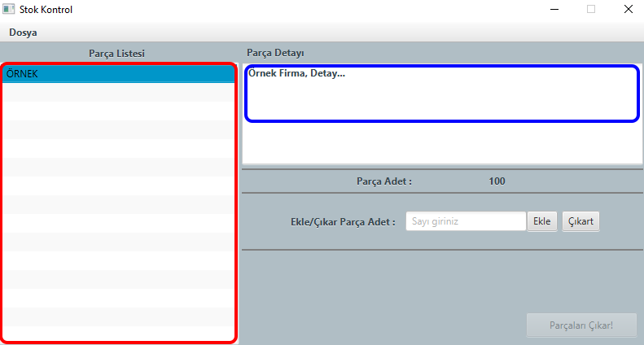
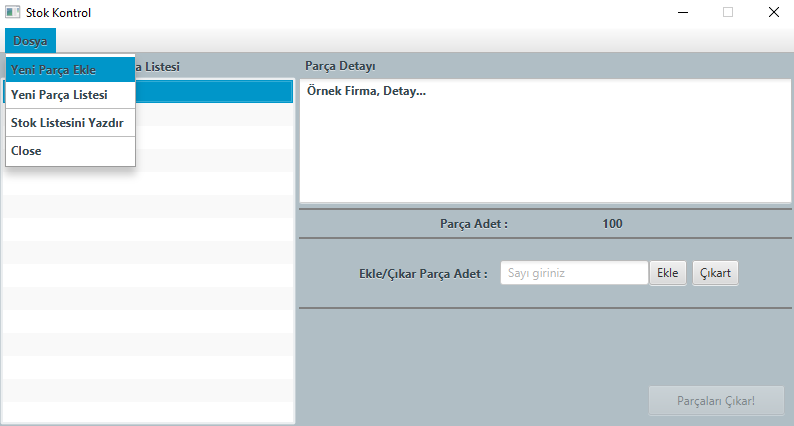
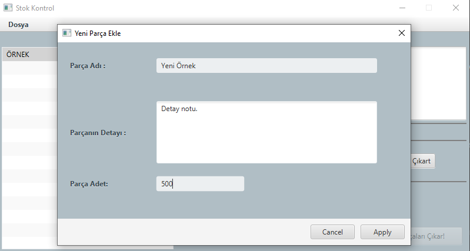
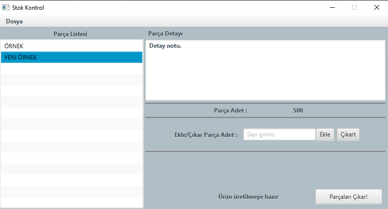
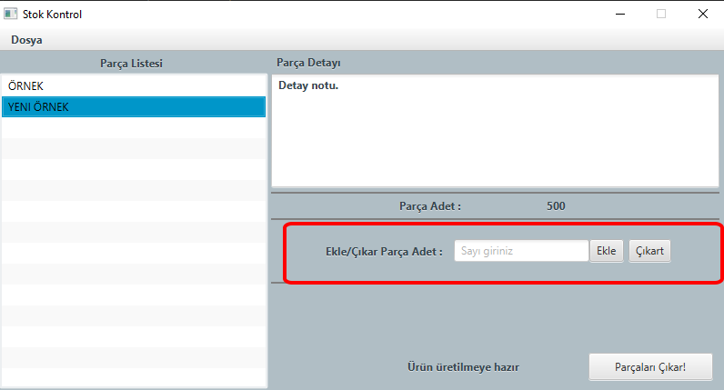
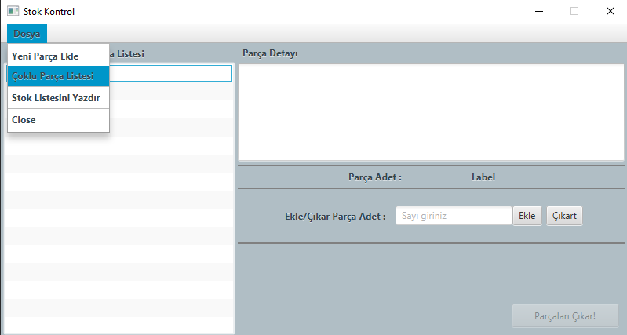
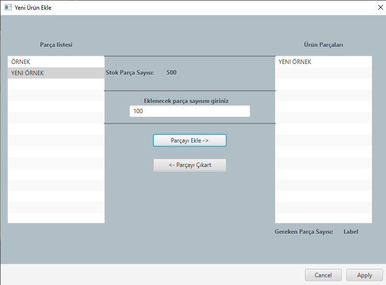
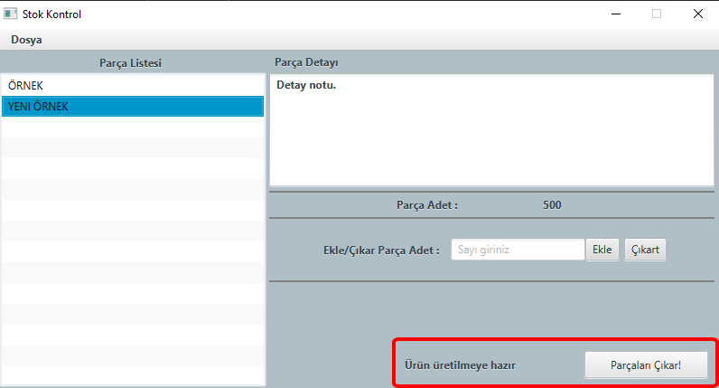
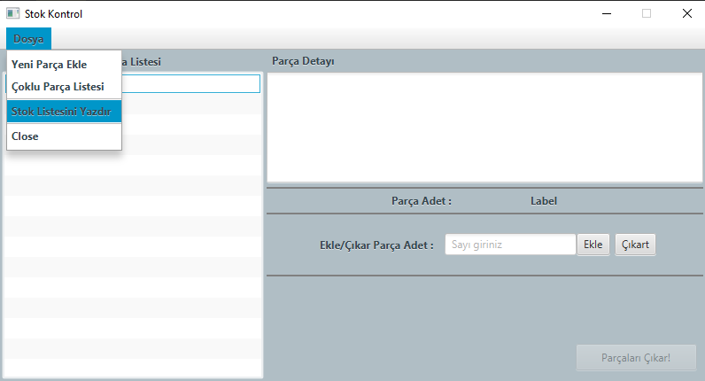

# Stock Control Application
---

The program only works on creating and maintaining a inventory list.

### Getting Started: 

> - Red Box is the Stock list 
> - Blue box is detail of item

### Add new item:

>You can press **File** *(Dosya)* menu and select **Add New Item** *(Yeni Parça Ekle)*.

> In the order: 
> * Item Name *(Parça Adı)*, Item Detail *(Parçanın Detayı)* , Item's Quantity *(Parça Miktarı)*

### Add Piece to item:

> If you need to add a few pieces item to stock list, you can use to this area. 
> Write the quantity then press right *(Ekle)* button to add or
> press left button to deduct *(Çıkar)*.

### Multiple Item To Reduce:

>You can press **File** *(Dosya)* menu and select **Multiple Piece list** *(Çoklu Parça listesi)*.

>You can create a new list to reduce the item using the stock list. First button is add
> selected item with quantity, second one is deducted item. You could Apply
when the new list is ready.

> If you press to **Reduce Items** *(Parçalar Çıkart)*, Stock list could deduct.

### Print To Item List:

>You can print when you want. You must just press to **Print Stock list** *(Stok listesini Yazdır)*

# Installation
---
- **You should use to link for clone the project.**
  *Öncelikle projeyi clonelamak için linki kullanın*
>https://github.com/EmreCerrah/StockControl.git
- **You must open another IDE after cloning**
  *Projeyi cloneladıktan sonra bir ide programında açınız.*

# Contributing
---
**Pull requests will be accepted. Open a discussions for the changes.**
*Pull requestler kabul edilir. Değişikliler için bir konu açınız.*
